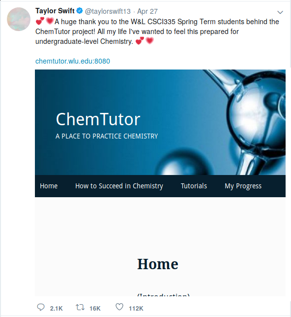

## Who am I?

- Graduated in 2014.
- Dropped out of Economics PhD
- Feb 2015 - API Team @ Livestream
- Oct 2017 - Vimeo Live @ Vimeo
- Sep 2018 - Developer Experience @ Vimeo

---

## What will I be talking about

1. What if this happens?

---

## Handling lots of traffic?
  - Caches
  - Scaling up

---

## Handling lots of developers?
  - APIs
  - Event Busses
  - "Microservices"

---

## Handling the haters who want to bring you down

  - Web authentication
  - XSS attacks
  - CSRF attacks (and CORS)

---

## Hiring / Interviewing
